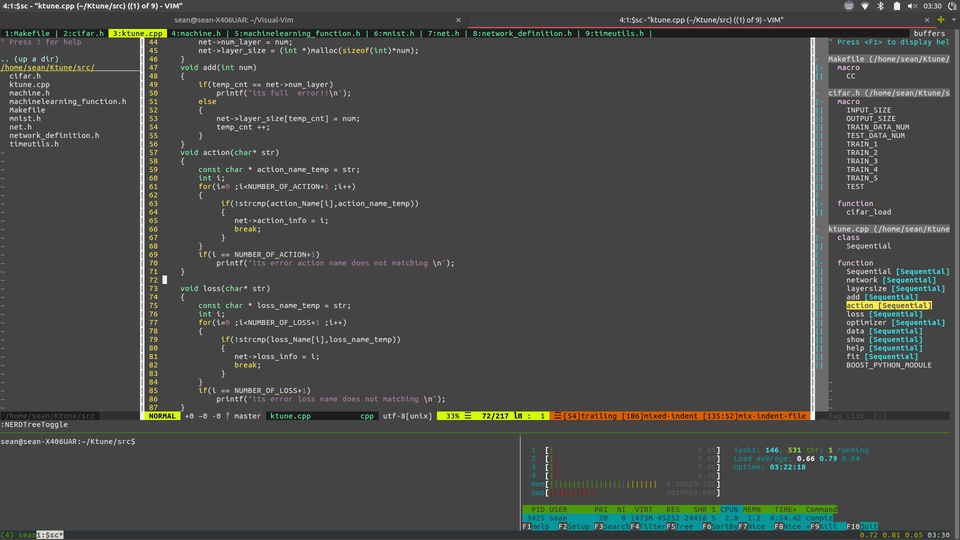

# Visual-Vim

### Visaul-Vim is Tmux utility for Vim user who want to use Vim like an IDE !!  
-----------------------------------------

# How to Install Visual-Vim?  

````sh    
$ wget https://raw.githubusercontent.com/ksy9164/Visual-Vim/master/install_vv.sh  
$ chmod +x ./install_vv.sh  
$ ./install_vv.sh  
````  
-----------------------------------------
  
# How to use Visual-Vim?  

### If you want to use Visual-Vim you can use 'vv'   

#### 1) Open files by using Visual-Vim  
````sh  
$ vv $file_name1 $file_name2 ...    
  
ex) $ vv ~/.bashrc  

````  

#### 2) Exit Visual-Vim (kill Visual-Vim session)  
````sh    
$ vq  
````  

#### 3) Detach Visual-Vim sessions  
````sh  
$ vd  
```` 

-----------------------------------------  

# How to control Visual-Vim session?

### If you want to control your Visual-Vim sessions you can use 'vvc' command   
  
  
#### 1) vvc list ( ls )   
Shows the currently running VV session list 
````sh
$ vvc ls   
````   

#### 2) vvc attach ( a )   
Reactivate the VV session   
vvc a $Session_number (you can use 'vvc ls' to get session_number)   
````sh  
$ vvc a $Session_number  
ex) $ vvc a 1  
````  

#### 3) vvc kill ( k )  
Kill the running VV session  
````sh  
$ vvc k $Session_number  
ex) $ vvc k 1  
````

#### 4) vvc clear ( c )  
Remove and Kill all VV sessions  
````sh  
$ vvc clear 
````  

#### 5) vvc help ( h )  
Print Visual-Vim manual  
````sh  
$ vvc help  
````  
-----------------------------------------
